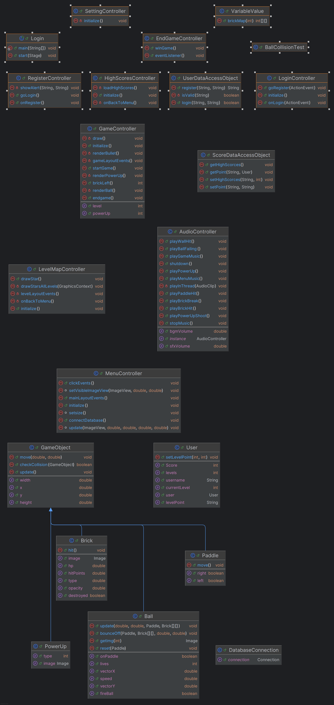
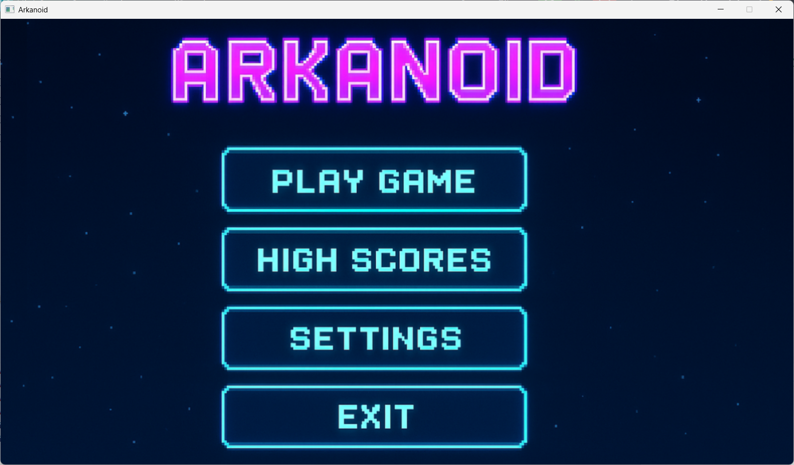
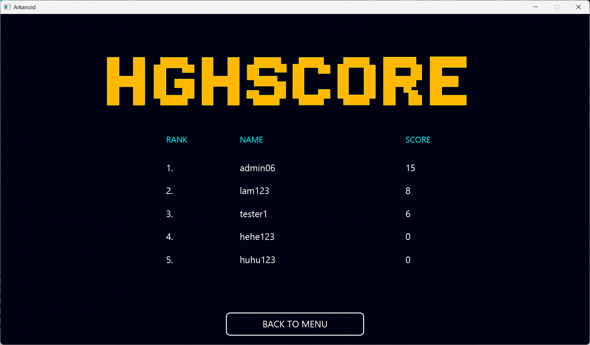
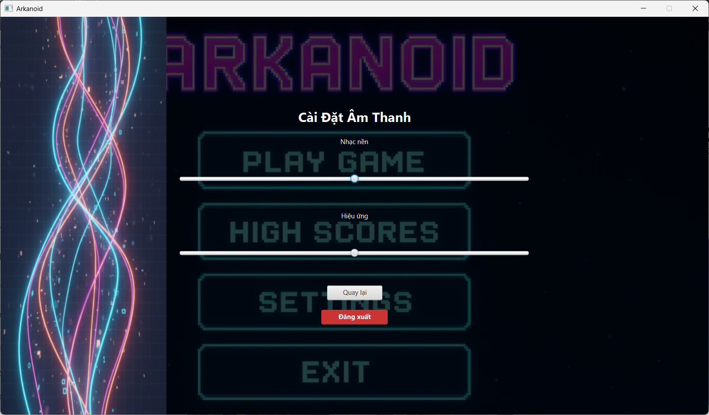
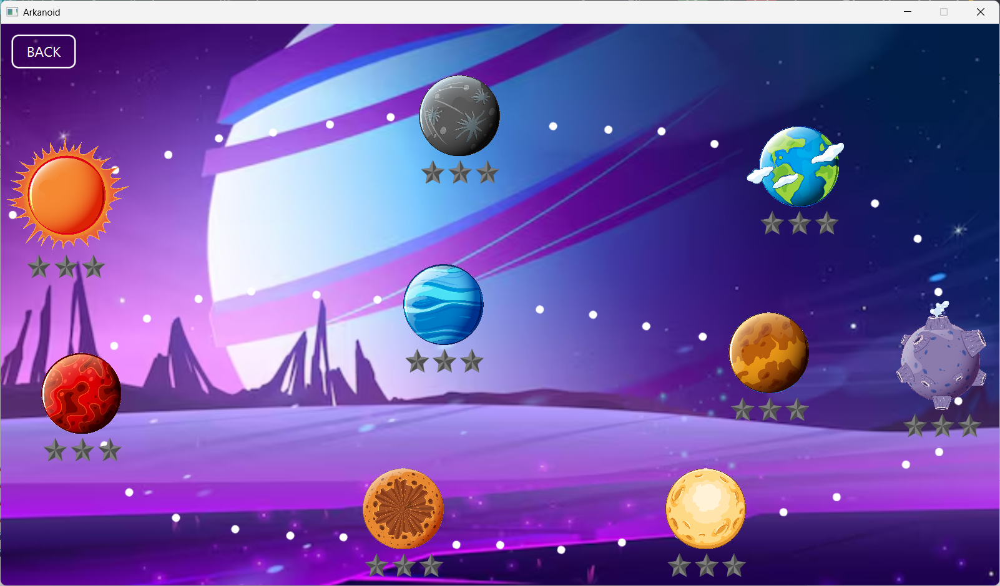
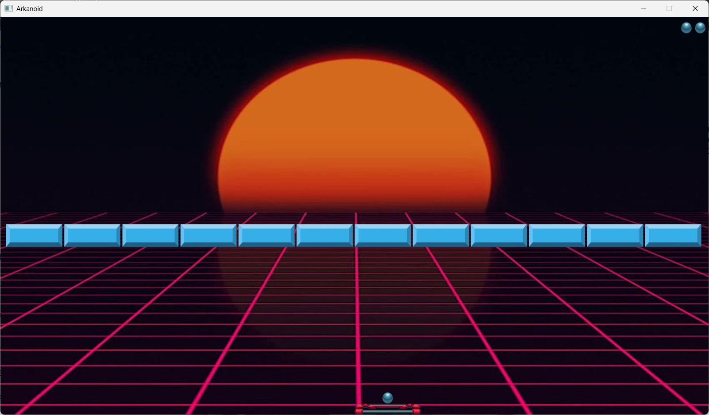

# Arkanoid Game - Object-Oriented Programming Project

## Author
Group 6 - Class 2526I_INT2204_4
1. 	Nguyễn Tuấn Lâm - 24020196
2. 	Doãn Minh Đạt - 24020061
3. Nguyễn Trọng Khang - 24020169

**Instructor**: Kiều Văn Tuyên
**Semester**: HK1 - 2025 - 2026

---

## Description
This is a classic Arkanoid game developed in Java as a final project for Object-Oriented Programming course. The project demonstrates the implementation of OOP principles and design patterns.

**Key features:**
1. The game is developed using Java 11+ with JavaFX/Swing for GUI.
2. Implements core OOP principles: Encapsulation, Inheritance, Polymorphism, and Abstraction.
3. Applies design patterns: Singleton.
4. Features multithreading for smooth gameplay, responsive UI and online database without UI blocking.
5. Includes sound effects, animations, and power-up systems.
6. Supports save/load game functionality and leaderboard system.

**Game mechanics:**
- Control a paddle to bounce a ball and destroy bricks
- Collect power-ups for special abilities
- Progress through multiple levels with increasing difficulty
- Score points and compete on the leaderboard

---

## UML Diagram

### Class Diagram

---

## Design Patterns Implementation

### 1. Singleton Pattern
**Used in:** `User`, `AudioController`

**Purpose:** Ensure only one instance exists throughout the application.

---

## Multithreading Implementation
The game uses multiple threads to ensure smooth performance:

1. **LogicLoop Thread**: Updates game logic at 40 FPS
2. **uiLoop Thread**: Handles graphics rendering (EDT for JavaFX Application Thread)
3. **Audio Thread Pool**: Plays sound effects asynchronously
4. **Database Thread**: Handles save/load online database without blocking UI

---

## Installation

1. Clone the project from the repository.
2. Open the project in the IDE.
3. Run the class Login in RenderView directory.

## Usage

### Controls
| Key | Action |
|-----|--------|
| `A` | Move paddle left |
| `D` | Move paddle right |
| `SPACE` | Launch ball |

### How to Play
1. **Start the game**: Click "New Game" from the main menu.
2. **Control the paddle**: Use arrow keys or A/D to move left and right.
3. **Launch the ball**: Press SPACE to launch the ball from the paddle.
4. **Destroy bricks**: Bounce the ball to hit and destroy bricks.
5. **Collect power-ups**: Catch falling power-ups for special abilities.
6. **Avoid losing the ball**: Keep the ball from falling below the paddle.
7. **Complete the level**: Destroy all destructible bricks to advance.

### Power-ups
| Icon | Name | Effect |
|------|------|--------|
|  | Expand Paddle | Increases paddle width |
|   | Shrink Paddle | Decreases paddle width |
|   | Fast Ball | Increases ball speed by 20% |
|   | Slow Ball | Decreases ball speed by 20% |
|   | Shoot | Shoot ball to destroy bricks for 9 seconds |
|   | Fire Ball | Hits a brick and explodes, destroying a 3×3 area of bricks. |

### Scoring System
- 1 ball left : 1 point
- 2 ball left : 2 point
- 3 ball left : 3 point
---

## Demo

### Screenshots
**Login**  

**Register**  

**Main Menu**  

**HighScores**  

**Setting**  

**LevelMap**  

**Gameplay**  

### Video Demo

---

## Future Improvements

### Planned Features
1. **Additional game modes**
   - Time attack mode
   - Survival mode with endless levels
   - Co-op multiplayer mode

2. **Enhanced gameplay**
   - More power-up varieties (freeze time, shield wall, etc.)
   - Achievements system

3. **Technical improvements**
   - Migrate to LibGDX or JavaFX for better graphics
   - Add particle effects and advanced animations
   - Implement AI opponent mode
   - Add online leaderboard with database backend

---

## Technologies Used

| Technology | Version | Purpose |
|------------|---------|---------|
| Java | 11 | Core language |
| JavaFX | 17.0.14 | GUI framework |
| Maven | 3.9.9 | Build tool |
| ControlsFX | 11.2.1 | UI controls library |
| FormsFX | 11.6.0 | Form controls library |
| BootstrapFX | 0.4.0 | CSS/Bootstrap styling |
| FXGL | 11.17 | Game library |
| JUnit | 5.12.1 | Unit testing |

---

## License

This project is developed for educational purposes only.

**Academic Integrity:** This code is provided as a reference. Please follow your institution's academic integrity policies.

---

## Notes

- The game was developed as part of the Object-Oriented Programming with Java course curriculum.
- All code is written by group members with guidance from the instructor.
- Some assets (images, sounds) may be used for educational purposes under fair use.
- The project demonstrates practical application of OOP concepts and design patterns.

---

*Last updated: [13/11/2025]*
